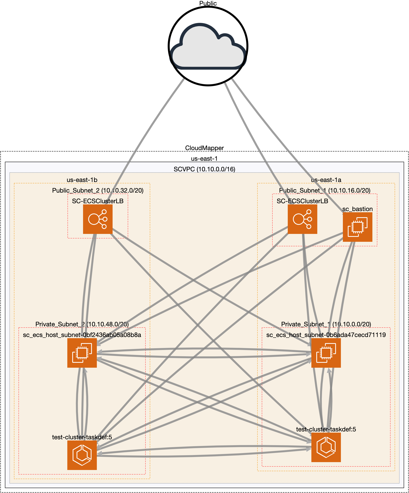

# Ansible Buildout Automation For ECS Service: From VPC to Service Launch


This ansible playbook builds out a highly available ECS environment serving web application containers from an EC2 instance in a private subnet from an application loadbalancer over 2 public subnets.
Also, includes a bastion host in public subnet for general maintenace of EC2 Instances in private subnet. 


Map of VPC using Duo Labs [Cloudmapper](https://github.com/duo-labs/cloudmapper):




## Installation

Currently tested with Python 3.7 (3.7.4). Use the package manager [pip](https://pip.pypa.io/en/stable/) to install pipenv. Then install dependencies from Pipfile.

```bash
pip install pipenv
pipenv install 
```

## Usage

```
ansible-playbook -vvv site.yml
```

## Future Improvements
* Better organization of playbooks, including variables/configuration files for deploying to different regions.
* Include various logging and health checks (i.e application, access, and network logs to cloudwatch)
* Separate playbooks for hardware patching, software upgrades, etc.


